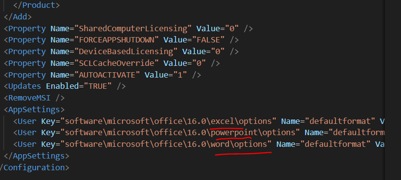
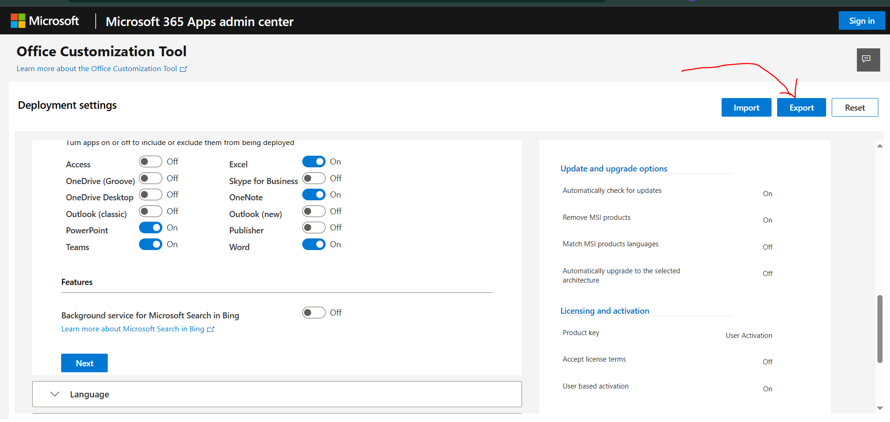
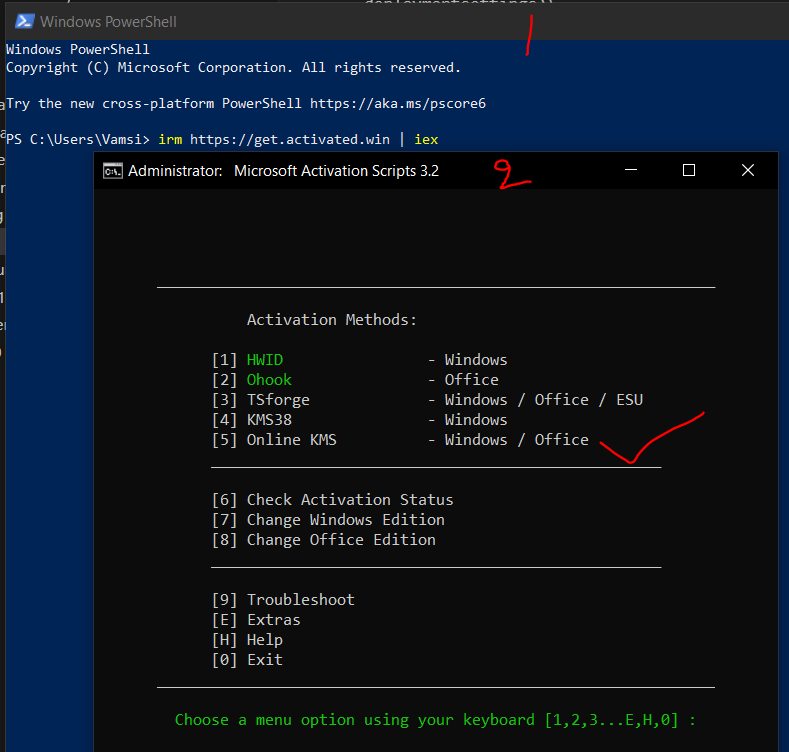
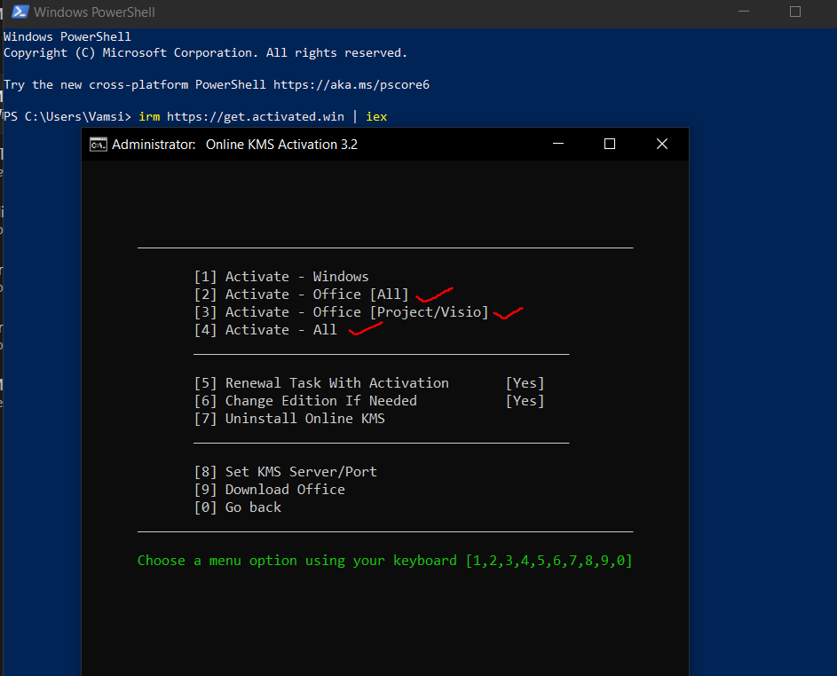

# Microsoft office or Office 365 setup and key

Requirement files \
1. Downloade the [Microsoft Office Deployment Tool](https://www.microsoft.com/en-us/download/details.aspx?id=49117)
2. After downloading and opening/installing this app will downloade two files\
a. [Office setup.exe]([text](files/setup.exe))
b.[configuration-Office365-x64.xml]([text](files/configuration-Office365-x64.xml))
3. you need a 3rd file called [configuration.xml]([text](files/Configuration.xml)) 

where you can donwload it from official website there you need to fill all the required details and need to export a confuration file which will be like the above file [Official Link](https://config.office.com/deploymentsettings)\
Note: in this file you can see the list of products that you want to add in office like: Excel, Powerpoint, Word, Team. 

4. Create a folder on desktop named ex: 365 and past the 3 files 1.Setup.exe 2.configuration-Office365-x64.xml 3.configuration.xml inside it.
5. Now open the commandpromt from the same folder,  or  else navigate to the same folder where the files are located.
6. Type this command to execute the application
> setup.exe /configure configuration.xml
#### try this command if the above command didn't worked
> setup.exe /configure  configuration-Office365-x64.xml
7. Now Office setup applicatoin will start running  and once the setup is ready try login with your office mail id or personal mail id
8. if it asks for a key 
 You can try this key > Y63J7-9RNDJ-GD3BV-BDKBP-HH966
9. For activation open power shell as administrator  type the command
>irm https://get.activated.win | iex 
10. now select number 5

11. Now try options 2, option 3, option 4
\
and check which option works for you.

### Thank you